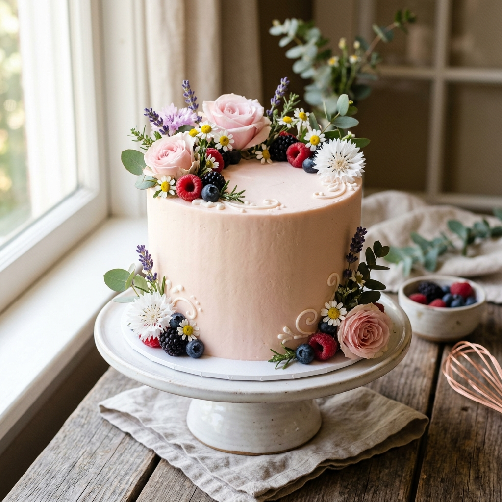

# 🍰 Sweet Site Bakery — Premium Homemade Cakes

<div align="center">



### *“Aesthetic bakes, unforgettable tastes. Made fresh, made for YOU.”* 🎂✨

[](https://developer.mozilla.org/en-US/docs/Web/HTML)
[](https://developer.mozilla.org/en-US/docs/Web/CSS)
[](https://developer.mozilla.org/en-US/docs/Web/JavaScript)
[](https://wa.me/8801852668468)
[](package.json)

**Sweet Site Bakery** is a modern, high-performance storefront and interactive single-page web application (SPA) built for an artisanal home bakery based in Rangpur, Bangladesh.

[Features](#-key-features) • [Quick Start](#-quick-start--local-development) • [Architecture](#-tech-stack--architecture) • [Menu & Catalog](#-menu--product-catalog) • [Deployment](#-deployment) • [Contact](#-contact)

</div>

---

## 🌟 Key Features

- 🎂 **Interactive Product Catalog**:
  - 45+ gourmet bakery products categorized across 12 product lines (Pound Cakes, Cupcakes, Jar Cakes, Lunch Box Cakes, Basque Cheesecakes, Swiss Rolls, Lava Cakes, Muffins, etc.).
  - Real-time instant search with suggestions and keyboard hotkey (`/`).
  - Multi-criteria sorting (Price: Low to High, Price: High to Low, Name A-Z, Menu Order).

- 🎨 **"Create Your Dream Cake" (6-Step Custom Cake Builder)**:
  - Step-by-step custom wizard allowing customers to choose:
    1. Occasion (Birthdays, Anniversaries, Weddings, etc.)
    2. Base flavour with live price calculations
    3. Custom cake size (0.5 lb to 2+ lb) & frosting types (Homemade butter, Ever Whipped, White chocolate)
    4. Design styling (Floral, Vintage piping, "From my photo") + color selection & extras
    5. Custom inscription message and date/time selector
    6. Seamless WhatsApp quotation dispatch

- 🛒 **Smart Cart & WhatsApp Checkout System**:
  - Persistent shopping cart backed by browser `localStorage`.
  - Automatic minimum order validation (৳499) with real-time visual progress indicator.
  - Generates pre-filled, structured WhatsApp order summaries with delivery address, phone number validation, and order itemization for direct fulfillment.

- ✨ **Boutique Aesthetic & Micro-Interactions**:
  - Responsive design tailored for mobile, tablet, and desktop viewports.
  - Interactive hero with 3D perspective tilt, animated candle glow, and drifting flower petal particles.
  - Smooth fly-to-cart animations, sprinkle particle bursts, and count-up price tickers.
  - Full `@media (prefers-reduced-motion: reduce)` accessibility compliance.

- 📸 **High-Resolution Custom Imagery**:
  - Integrated studio-grade photography across all categories and products.

---

## 🚀 Quick Start & Local Development

Because this project is built with standard web technologies and zero build step dependencies, it can be run immediately on any system:

### Option 1: Direct Browser Launch
Simply double-click `index.html` to open it in any web browser.

### Option 2: Local HTTP Server (Recommended)

Using **Node.js**:
```bash
# Using npx serve
npx serve .

# Or using http-server
npx http-server -p 8080 .
```

Using **Python**:
```bash
# Python 3
python -m http.server 8080
```

Open your browser at `http://localhost:8080`.

---

## 🛠️ Tech Stack & Architecture

```
sweet-site-bakery/
├── index.html           # Core application (HTML5, Design Tokens, Vanilla JS & Router)
├── README.md            # Comprehensive project documentation
├── README.txt           # Deployment cheat-sheet
└── assets/
    ├── logo.jpg         # Official brand logo
    └── cakes/           # High-resolution product & category photography
        ├── red-velvet.jpg
        ├── chocolate-overloaded.jpg
        ├── basque-cheesecake.jpg
        ├── roshmalai.jpg
        ├── black-forest.jpg
        ├── chocolate-mousse.jpg
        ├── lava-cake.jpg
        ├── jar-cakes.jpg
        ├── cup-cakes.jpg
        ├── lunch-box-cakes.jpg
        ├── muffins.jpg
        ├── pastry-cakes.jpg
        ├── pound-cakes.jpg
        ├── pound-slices.jpg
        ├── swiss-rolls.jpg
        ├── cheesecakes.jpg
        ├── chocolate-cakes.jpg
        └── tab-cakes.jpg
```

- **Frontend**: HTML5 Semantic markup, ARIA accessibility attributes, landmark navigation.
- **Styling**: Vanilla CSS3 custom variables (`--butter`, `--blush`, `--lav`, `--gold`, `--cocoa`), CSS Grid, Flexbox, keyframe animations, clamp typography.
- **Client-Side Routing**: Hash-based single-page navigation (`#/`, `#/shop`, `#/cakes/:id`, `#/cart`, `#/checkout`, `#/customize-cake`, `#/about`, `#/contact`, `#/faq`).
- **Typography**: Google Fonts ([`Cormorant Garamond`](https://fonts.google.com/specimen/Cormorant+Garamond) + [`Inter`](https://fonts.google.com/specimen/Inter)).

---

## 📋 Menu & Product Catalog

| Category | Size / Unit | Flavours & Highlights | Starting Price |
| :--- | :--- | :--- | :--- |
| **Pound Cakes** | 1.5 lb | Vanilla, Orange, Strawberry, Mango, Lemon, Chocolate, Red Velvet, Black Forest, Roshmalai, Basque Burnt Cheesecake | ৳599 – ৳1,999 |
| **Cupcakes** | Per piece | Vanilla, Chocolate with rich swirl buttercream | ৳39 – ৳49 |
| **Pastry Cakes** | Per piece | Vanilla Opera, Dark Chocolate slice | ৳79 – ৳99 |
| **Jar Cakes** | Per piece | Multi-layered cake, cream, and fudge in glass jars | ৳149 – ৳199 |
| **Tab / Tub Cakes** | Per piece | Creamy dessert tub cakes | ৳279 – ৳349 |
| **Lunch Box Cakes** | Per piece | Korean Bento aesthetic mini cakes | ৳299 – ৳379 |
| **Muffins** | Per box | Freshly baked blueberry and chocolate chip | ৳499 – ৳599 |
| **Swiss Rolls** | Per box | Swirled vanilla cream and strawberry sponge | ৳599 – ৳699 |
| **Lava Cakes** | Per piece | Molten warm dark chocolate | ৳999 |

---

## 🌐 Deployment

The project can be deployed instantly to any static host:

### GitHub Pages
1. Push this repository to GitHub.
2. In your repo settings, navigate to **Pages**.
3. Under **Build and deployment > Branch**, select `main` and root `/`.
4. Click **Save**.

### Netlify
1. Go to [app.netlify.com/drop](https://app.netlify.com/drop).
2. Drag and drop the `sweet-site-bakery` folder onto the browser window.

### Vercel
```bash
npx vercel
```

---

## 📞 Contact & Bakery Details

- **Bakery**: Sweet Site Bakery
- **Location**: Rangpur, Bangladesh
- **Phone**: [+880 1852-668468](tel:+8801852668468)
- **WhatsApp**: [01852-668468](https://wa.me/8801852668468)
- **Facebook**: [facebook.com/sweetsitebakery1229](https://www.facebook.com/sweetsitebakery1229)

---

<div align="center">
  <sub>Handcrafted with ❤️ for Sweet Site Bakery, Rangpur.</sub>
</div>
